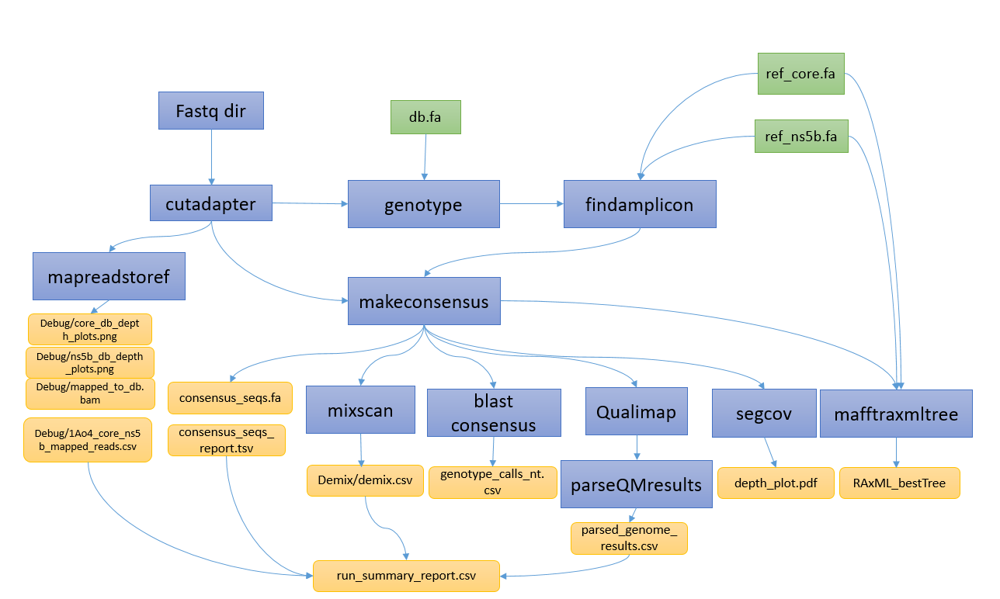

# hcv_nf

The process for genotyping HCV is partially adapted from [FluViewer tool](https://github.com/KevinKuchinski/FluViewer).

The workflow is captured in the .


## usage

```
nextflow run BCCDC-PHL/hcv_nf \
  --fastq_input <path/to/fastq/dirs> \
  --db <path/to/ref/db> \
  --ref_core <path/to/ref_core/db> \
  --ref_ns5b <path/to/ref_ns5b/db> \
  --outdir <path/to/output_dir> \ 
```
